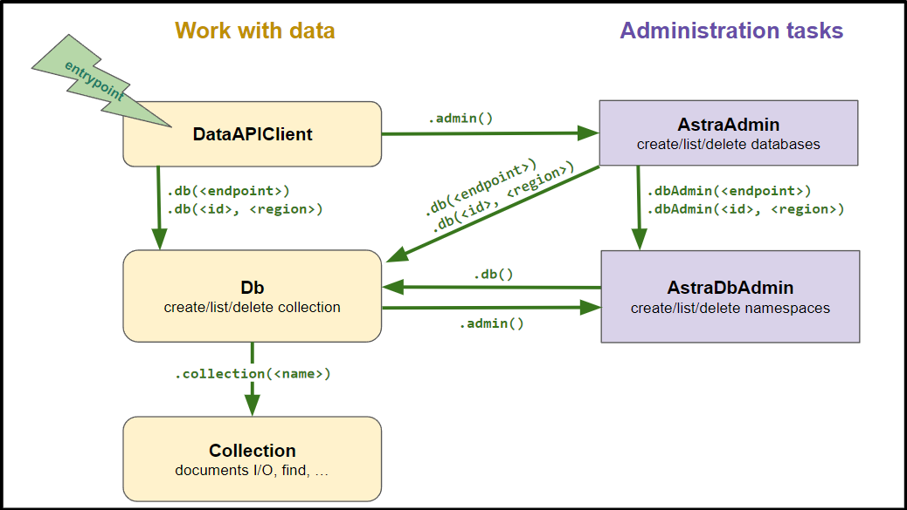

# @datastax/astra-db-ts

`astra-db-ts` is a TypeScript client for interacting with [DataStax Astra DB](https://astra.datastax.com/signup).

*This README targets v1.0.0+, which introduces a whole new API. Click [here](https://www.youtube.com/watch?v=dQw4w9WgXcQ) for the pre-existing client readme.*

*For the sake of my job, I hope I remember to update that link before release.*

## Quickstart

Use your preferred package manager to install `@datastax/astra-db-ts`. Note that this requires a Node-compatable runtime.

Get the *API endpoint* and your *applicaton token* for your Astra DB instance @ [astra.datastax.com](https://astra.datastax.com).

Try the following code after setting the following environment variables:

```typescript
import { DataAPIClient, VectorDoc, UUID, ObjectId } from '@datastax/astra-db-ts';

// Schema for the collection (VectorDoc adds the $vector field)
interface Idea extends VectorDoc {
  idea: string,
}

// Connect to the db
const client = new DataAPIClient('*TOKEN*');
const db = client.db('*ENDPOINT*', { namespace: '*NAMESPACE*' });

(async () => {
  // Creates collection, or gets it if it already exists with same options
  const collection = await db.createCollection<Idea>('vector_5_collection', {
    vector: {
      dimension: 5,
      metric: 'cosine'
    },
  });

  // Insert many ideas into the collection
  const ideas = [
    {
      idea: 'An AI quilt to help you sleep forever',
      $vector: [0.1, 0.15, 0.3, 0.12, 0.05],
    },
    {
      _id: new UUID('e7f1f3a0-7e3d-11eb-9439-0242ac130002'),
      idea: 'Vision Vector Frame—A deep learning display that controls your mood',
      $vector: [0.1, 0.05, 0.08, 0.3, 0.6],
    },
    {
      idea: 'A smartwatch that tells you what to eat based on your mood',
      $vector: [0.2, 0.3, 0.1, 0.4, 0.15],
    },
  ];
  await collection.insertMany(ideas);

  // Insert a specific idea into the collection
  const sneakersIdea = {
    _id: new ObjectId('507f191e810c19729de860ea'),
    idea: 'ChatGPT-integrated sneakers that talk to you',
    $vector: [0.45, 0.09, 0.01, 0.2, 0.11],
  }
  await collection.insertOne(sneakersIdea);

  // Actually, let's change that idea
  await collection.updateOne(
    { _id: sneakersIdea._id },
    { $set: { idea: 'Gemini-integrated sneakers that talk to you' } },
  );

  // Get similar results as desired
  const cursor = collection.find({}, {
    vector: [0.1, 0.15, 0.3, 0.12, 0.05],
    includeSimilarity: true,
    limit: 2,
  });

  for await (const doc of cursor) {
    // Prints the following:
    // - An AI quilt to help you sleep forever: 1
    // - A smartwatch that tells you what to eat based on your mood: 0.85490346
    console.log(`${doc.idea}: ${doc.$similarity}`);
  }
})();
```

Next steps:
- More info and usage patterns are given in the ts-doc of classes and methods
- [TS client reference](https://docs.datastax.com/en/astra/astra-db-vector/clients/typescript.html)
- [Data API reference](https://docs.datastax.com/en/astra/astra-db-vector/api-reference/data-api-commands.html)
- Package on [npm](https://www.npmjs.com/package/@datastax/astra-db-ts)

## astra-db-ts's API

### Abstraction diagram

astra-db-ts's abstractions for working at the data and admin layers are structured as depicted by this diagram:



Here's a small admin-oriented example:

```typescript
import { DataAPIClient } from '@datastax/astra-db-ts';

// Spawn an admin 
const client = new DataAPIClient('*TOKEN*');
const admin = client.admin();

(async () => {
  // list info about all databases
  const databases = await admin.listDatabases();
  const dbInfo = databases[0];
  console.log(dbInfo.info.name, dbInfo.id, dbInfo.info.region);

  // list namespaces for the first database
  const dbAdmin = admin.dbAdmin(dbInfo.id, dbInfo.info.region);
  console.log(await dbAdmin.listNamespaces());
})();
```

## Working with ObjectIds and UUIDs

astra-db-ts exports an `ObjectId` and `UUID` class for working with these types in the database. Here's an example:

```typescript
import { DataAPIClient, ObjectId, UUID } from '@datastax/astra-db-ts';

interface Person {
  _id: ObjectId | UUID,
  name: string,
  friendId?: string,
}

// Connect to the db
const client = new DataAPIClient('*TOKEN*');
const db = client.db('*ENDPOINT*', { namespace: '*NAMESPACE*' });

(async () => {
  // Create a collection with a UUIDv7 as the default ID
  const collection = await db.createCollection<Person>('my_collection', { defaultId: { type: 'uuidv7' } });
  
  // You can manually set whatever ID you want
  await collection.insertOne({ _id: new ObjectId("65fd9b52d7fabba03349d013"), name: 'John' });
  
  // Or use the default ID
  await collection.insertOne({ name: 'Jane' });
  
  // Let's give Jane a friend with a UUIDv4 
  const friendId = UUID.v4();

  await collection.insertOne({ name: 'Alice', _id: friendId });
  
  await collection.updateOne(
    { name: 'Jane' },
    { $set: { friendId: friendId.toString() } },
  );
  
  // And let's get Jane as a document
  // (Prints "Jane", the generated UUIDv4, and true)
  const jane = await collection.findOne({ name: 'Jane' });
  console.log(jane?.name, jane?.friendId, friendId.equals(jane?.friendId));
})();
```

Note that these are custom classes, and *not* the ones from the `bson` package. Make sure you're using the right one!
