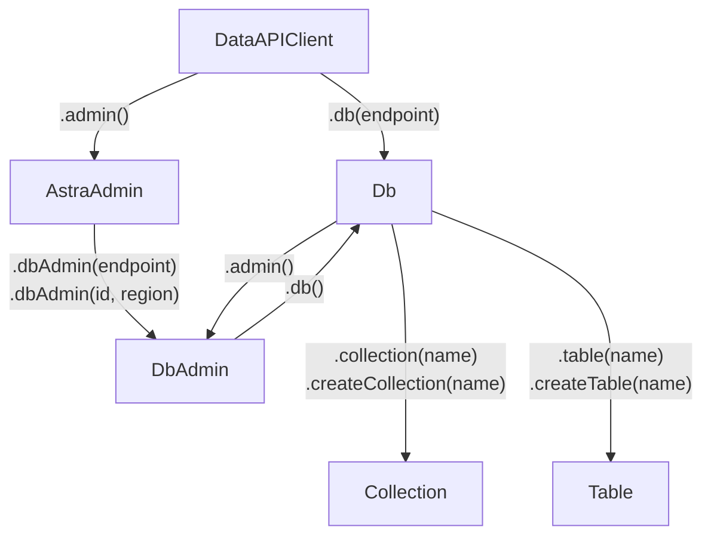
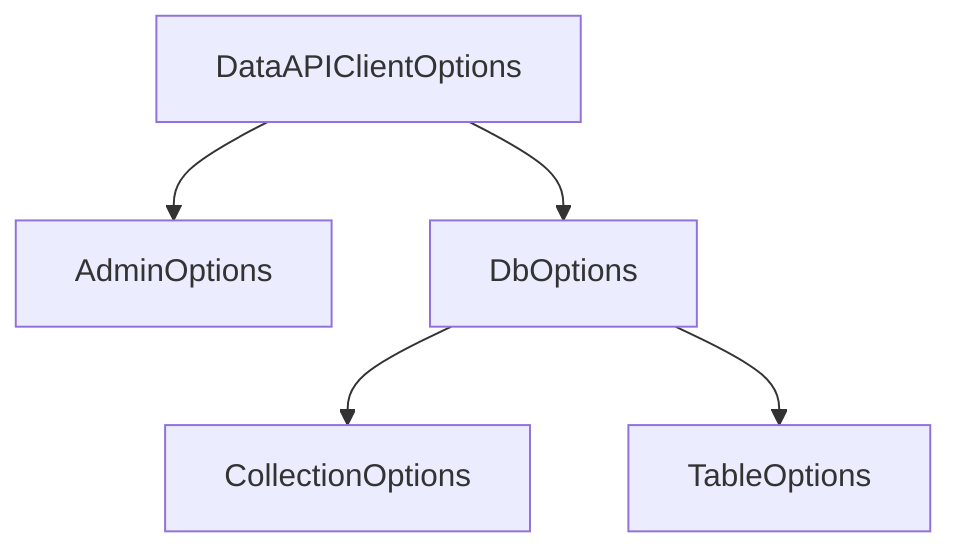

# @datastax/astra-db-ts

`astra-db-ts` is a TypeScript client for interacting with [DataStax Astra DB](https://astra.datastax.com/signup).

> **Warning**
> This README is still under construction; parts of it may be incomplete or outdated.

*This README targets v2.0.0+, which expands on the previous 1.x API. Click [here](https://github.com/datastax/astra-db-ts/tree/v1.x?tab=readme-ov-file#datastaxastra-db-ts) for the pre-existing client readme.*

## Table of contents
- [Quickstart](#quickstart)
  - [Collections](#collections)
  - [Tables](#tables)
- [High-level architecture](#high-level-architecture)
  - [Options hierarchy](#options-hierarchy)
- [Datatypes](#datatypes)
[Non-astra support](#non-astra-support)
- [Non-standard environment support](#non-standard-environment-support)
  - [HTTP/2 with minification](#http2-with-minification)
  - [Browser support](#browser-support)

## Quickstart

Use your preferred package manager to install `@datastax/astra-db-ts`. Note that this is not supported in browsers.

Get the *API endpoint* and your *application token* for your Astra DB instance @ [astra.datastax.com](https://astra.datastax.com).

### Collections

```typescript
import { DataAPIClient, ObjectId, vector, VectorDoc, oid } from '@datastax/astra-db-ts';

// Connect to the db
const client = new DataAPIClient({ logging: 'all' });
const db = client.db(process.env.CLIENT_DB_URL!, { token: process.env.CLIENT_DB_TOKEN! });

// The `VectorDoc` interface adds `$vector?: DataAPIVector` as a field to the collection type
interface Dream extends VectorDoc {
  _id: ObjectId,
  summary: string,
  tags?: string[],
}

(async () => {
  // Create the collection with a custom default ID type
  const collection = await db.createCollection<Dream>('dreams', {
    defaultId: { type: 'objectId' },
  });

  // Batch-insert some rows into the table. 
  // _id can be optionally provided, or be auto-generated @ the server side
  await collection.insertMany([{
    summary: 'A dinner on the Moon',
    $vector: vector([0.2, -0.3, -0.5]),
  }, {
    summary: 'Riding the waves',
    $vector: vector([0, 0.2, 1]),
    tags: ['sport'],
  }, {
    _id: oid('674f0f5c1c162131319fa09e'),
    summary: 'Meeting Beethoven at the dentist',
    $vector: vector([0.2, 0.6, 0]),
  }]);

  // Hm, changed my mind
  await collection.updateOne({ _id: oid('674f0f5c1c162131319fa09e') }, { $set: { summary: 'Surfers\' paradise' } });

  // Let's see what we've got, by performing a vector search
  const cursor = collection.find({})
    .sort({ vector: vector([0, 0.2, 0.4]) })
    .includeSimilarity(true)
    .limit(2);

  // This would print:
  // - Surfers' paradise: 0.98238194
  // - Friendly aliens in town: 0.91873914
  for await (const result of cursor) {
    console.log(`${result.summary}: ${result.$similarity}`);
  }

  // Cleanup (if desired)
  await collection.drop();
})();
```

### Tables

```typescript
import { DataAPIClient, InferTableSchema, Table, vector } from '@datastax/astra-db-ts';

// Connect to the db
const client = new DataAPIClient({ logging: 'all' });
const db = client.db(process.env.CLIENT_DB_URL!, { token: process.env.CLIENT_DB_TOKEN! });

// Define the table's schema so we can infer the type of the table automatically (TS v5.0+)
const DreamsTableSchema = Table.schema({
  columns: {
    id: 'int',
    summary: 'text',
    tags: { type: 'set', valueType: 'text' },
    vector: { type: 'vector', dimension: 3 },
  },
  primaryKey: 'id',
});

// Infer the TS-equivalent type from the table definition (like zod or arktype). Equivalent to:
//
// interface TableSchema {
//   id: number,
//   summary?: string | null,
//   tags?: Set<string>,
//   vector?: DataAPIVector | null,
// }
type Dream = InferTableSchema<typeof DreamsTableSchema>;

(async () => {
  // Create the table if it doesn't already exist
  // Table will be typed as `Table<Dream, { id: number }>`, where the former is the schema, and the latter is the primary key
  const table = await db.createTable('dreams', {
    definition: DreamsTableSchema,
    ifNotExists: true,
  });

  // Create a vector index on the vector column so we can perform ANN searches on the table
  await table.createVectorIndex('dreams_vector_idx', 'vector', {
    options: { metric: 'cosine' },
    ifNotExists: true,
  });

  // Batch-insert some rows into the table
  const rows: Dream[] = [{
    id: 102,
    summary: 'A dinner on the Moon',
    vector: vector([0.2, -0.3, -0.5]),
  }, {
    id: 103,
    summary: 'Riding the waves',
    vector: vector([0, 0.2, 1]),
    tags: new Set(['sport']),
  }, {
    id: 37,
    summary: 'Meeting Beethoven at the dentist',
    vector: vector([0.2, 0.6, 0]),
  }];
  await table.insertMany(rows);

  // Hm, changed my mind
  await table.updateOne({ id: 103 }, { $set: { summary: 'Surfers\' paradise' } });

  // Let's see what we've got, by performing a vector search
  const cursor = table.find({})
    .sort({ vector: vector([0, 0.2, 0.4]) })
    .includeSimilarity(true)
    .limit(2);

  // This would print:
  // - Surfers' paradise: 0.98238194
  // - Friendly aliens in town: 0.91873914
  for await (const result of cursor) {
    console.log(`${result.summary}: ${result.$similarity}`);
  }

  // Cleanup (if desired)
  await table.drop();
})();
```

<details>
  <summary><i>Inferring the table schema pre-TS v5.0</i></summary>

  Before TypeScript 5.0, there was no support for "const type parameters" (e.g. `f<const T>(t: T): T`) which `Table.schema` relies on.

  No worries though—if you're using TypeScript 4.x or below, you can still infer the schema automatically, albeit with less language server support.

  Schema object type errors may be non-local and harder to debug, but the code will still work as expected.

  ```ts
  const DreamsTableSchema = <const>{
    columns: {
      id: 'int',
      summary: 'text',
      tags: { type: 'set', valueType: 'text' },
      vector: { type: 'vector', dimension: 3 },
    },
    primaryKey: 'id',
  };

  // Still works, but you need to ensure DreamsTableSchema is a properly typed const object
  type Dream = InferTableSchema<typeof DreamsTableSchema>;
  type DreamPK = InferTablePrimaryKey<typeof DreamsTableSchema>;

  (async () => {
    // Necessary to explicitly set the type of the table schema and primary key here
    const table = await db.createTable<Dream, DreamPK>('dreams', {
      definition: DreamsTableSchema,
      ifNotExists: true,
    });
  })();
  ```

  If you're using TypeScript 4.9, you can at least use the `satisfies` operator to localize any definition type errors.

  ```ts
  const DreamsTableSchema = <const>{
    columns: {
      id: 'int',
      summary: 'text',
      tags: { type: 'set', valueType: 'text' },
      vector: { type: 'vector', dimension: 3 },
    },
    primaryKey: 'id',
  } satisfies CreateTableDefinition;

  type Dream = InferTableSchema<typeof DreamsTableSchema>;
  ```
</details>

### Next steps

- More info and usage patterns are given in the ts-doc of classes and methods
- [TS client reference](https://docs.datastax.com/en/astra/astra-db-vector/clients/typescript.html)
- [Data API reference](https://docs.datastax.com/en/astra/astra-db-vector/api-reference/data-api-commands.html)
- Package on [npm](https://www.npmjs.com/package/@datastax/astra-db-ts)

## High-level architecture

`astra-db-ts`'s abstractions for working at the data and admin layers are structured as depicted by this diagram:



Here's a small admin-oriented example:

```typescript
import { DataAPIClient } from '@datastax/astra-db-ts';

// Spawn an admin 
const client = new DataAPIClient('*TOKEN*');
const admin = client.admin();

(async () => {
  // list info about all databases
  const databases = await admin.listDatabases();
  const dbInfo = databases[0];
  console.log(dbInfo.info.name, dbInfo.id, dbInfo.info.region);

  // list namespaces for the first database
  const dbAdmin = admin.dbAdmin(dbInfo.id, dbInfo.info.region);
  console.log(await dbAdmin.listNamespaces());
})();
```

### Options hierarchy

Like the client hierarchy, the options for each class also exist in a hierarchy.

The general options for parent classes are deeply merged with the options for child classes.



## Datatypes

See [DATATYPES.md](etc/docs/DATATYPES.md) for a full list of supported datatypes and their TypeScript equivalents.

## Non-astra support

`astra-db-ts` officially supports Data API instances using non-Astra backends, such as Data API on DSE or HCD. 

However, while support is native, detection is not; you will have to manually declare the environment at times.

```typescript
import { DataAPIClient, UsernamePasswordTokenProvider, DataAPIDbAdmin } from '@datastax/astra-db-ts';

// You'll need to pass in environment to the DataAPIClient when not using Astra
const tp = new UsernamePasswordTokenProvider('*USERNAME*', '*PASSWORD*');
const client = new DataAPIClient(tp, { environment: 'dse' });
const db = client.db('*ENDPOINT*');

// A common idiom may be to use `dbAdmin.createKeyspace` with `updateDbKeyspace` to initialize the keyspace when necessary
const dbAdmin = db.admin({ environment: 'dse' });
dbAdmin.createKeyspace('...', { updateDbKeyspace: true });
```

The `TokenProvider` class is an extensible concept to allow you to create or even refresh your tokens
as necessary, depending on the Data API backend. Tokens may even be omitted if necessary.

`astra-db-ts` provides two `TokenProvider` instances by default:
- `StaticTokenProvider` - This unit provider simply regurgitates whatever token was passed into its constructor
- `UsernamePasswordTokenProvider` - Turns a user/pass pair into an appropriate token for DSE/HCD

(See `examples/non-astra-backends` for a full example of this in action.)

## Non-standard environment support

`astra-db-ts` is designed first and foremost to work in Node.js environments. 

However, it will work in edge runtimes and other non-node environments as well, though it may use the native `fetch` API for HTTP
requests, as opposed to `fetch-h2` which provides extended HTTP/2 and HTTP/1.1 support for performance.

By default, it'll attempt to use `fetch-h2` if available, and fall back to `fetch` if not available in that environment.
You can explicitly force the fetch implementation when instantiating the client:

```typescript
import { DataAPIClient } from '@datastax/astra-db-ts';

const client = new DataAPIClient('*TOKEN*', {
  httpOptions: { client: 'fetch' },
});
```

There are four different behaviours for setting the client:
- Not setting the `httpOptions` at all
  - This will attempt to use `fetch-h2` if available, and fall back to `fetch` if not available
- `client: 'default'` or `client: undefined` (or unset)
  - This will attempt to use `fetch-h2` if available, and throw an error if not available
- `client: 'fetch'`
  - This will always use the native `fetch` API
- `client: 'custom'`
  - This will allow you to pass a custom `Fetcher` implementation to the client

On some environments, such as Cloudflare Workers, you may additionally need to use the events
polyfill for the client to work properly (i.e. `npm i events`). Cloudflare's node-compat won't
work here.

Check out the `examples/` subdirectory for some non-standard runtime examples with more info.

### HTTP/2 with minification

Due to the variety of different runtimes JS can run in, `astra-db-ts` does its best to be as flexible as possible.
Unfortunately however, because we need to dynamically require the `fetch-h2` module to test whether it works, the
dynamic import often breaks in minified environments, even if the runtime properly supports HTTP/2.

There is a simple workaround however, consisting of the following steps, if you really want to use HTTP/2:
1. Install `fetch-h2` as a dependency (`npm i fetch-h2`)
2. Import the `fetch-h2` module in your code as `fetchH2` (i.e. `import * as fetchH2 from 'fetch-h2'`)
3. Set the `httpOptions.fetchH2` option to the imported module when instantiating the client

```typescript
import { DataAPIClient } from '@datastax/astra-db-ts';
import * as fetchH2 from 'fetch-h2';

const client = new DataAPIClient('*TOKEN*', {
  httpOptions: { fetchH2 },
});
```

This way, the dynamic import is avoided, and the client will work in minified environments.

Note this is not required if you don't explicitly need HTTP/2 support, as the client will default 
to the native fetch implementation instead if importing fails. 

(But keep in mind this defaulting will only happen if `httpOptions` is not set at all).

(See `examples/http2-when-minified` for a full example of this workaround in action.)

### Browser support

`astra-db-ts` is designed to work in server-side environments, but it can technically work in the browser as well.

However, if, for some reason, you really want to use this in a browser, you may need to install the `events` polyfill,
and possibly set up a CORS proxy (such as [CORS Anywhere](https://github.com/Rob--W/cors-anywhere)) to forward requests 
to the Data API.

But keep in mind that this may be very insecure, especially if you're hardcoding sensitive data into your client-side
code, as it's trivial for anyone to inspect the code and extract the token (through XSS attacks or otherwise).

(See `examples/browser` for a full example of browser usage in action.)
